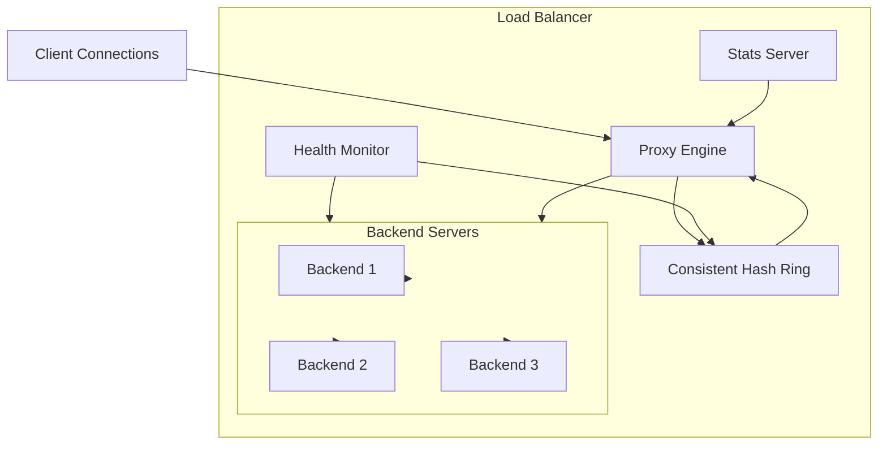

# System Design Document: TCP Load Balancer

**Author**: Harsh Mittal  

**Status**: Implemented & Load Tested  

**Date**: July 2026

## 1. Abstract

This document outlines the architecture and implementation of a high-performance, Layer-4 (TCP) Load Balancer written entirely in Go using the standard library. The system provides robust traffic distribution, fault tolerance through active health monitoring, and deterministic routing via a consistent hash ring. It is designed to handle high concurrent connection volumes with minimal latency overhead, validated through rigorous k6 stress testing.

---

## 2. Goals & Non-Goals

### Goals
- **High Throughput & Low Latency**: efficiently route TCP traffic with minimal CPU and memory overhead.
- **Deterministic Routing**: Ensure connections from the same client IP are consistently routed to the same backend server (Session Affinity).
- **Fault Tolerance**: Automatically detect backend failures and seamlessly evict/reinstate nodes without dropping active healthy sessions.
- **Graceful Lifecycle Management**: Support zero-downtime draining of in-flight sessions during shutdown.
- **Zero-Dependency Core**: Rely exclusively on the Go standard library for the core proxy engine to minimize supply-chain risks and binary size.

### Non-Goals
- Layer-7 (HTTP/HTTPS) parsing or routing (e.g., path-based routing).
- TLS Termination (currently out of scope, planned for future iterations).
- Persistent state storage (the hash ring and health states are strictly in-memory).

---

## 3. Architecture Overview

The load balancer consists of four loosely coupled primary components orchestrated by the main application lifecycle:

---

## 4. Component Design

### 4.1. Consistent Hash Ring (`ring/ring.go`)
To achieve session affinity without maintaining a stateful session table (which limits horizontal scalability), the load balancer utilizes a Consistent Hash Ring.

- **Algorithm**: FNV-1a (32-bit). Chosen for its excellent distribution properties and low computational overhead.
- **Virtual Nodes**: To prevent "hot spots" and ensure even traffic distribution across the backend fleet, each physical backend is assigned 100 virtual nodes scattered across the ring.
- **Lookups**: `O(log N)` complexity. The ring is maintained as a sorted slice of hash values. When a client connects, their IP is hashed, and `sort.Search` is used to find the nearest clockwise virtual node.
- **Concurrency**: Guarded by a `sync.RWMutex`. Lookups acquire a read lock (allowing highly concurrent routing), while backend evictions/additions acquire a write lock.

### 4.2. Health Monitor (`monitor/health.go`)
The health monitor acts as the immune system of the load balancer.

- **Active Probing**: Every 5 seconds, a dedicated goroutine attempts a TCP dial to every registered backend with a strict 2-second timeout.
- **3-Strike Eviction**: To prevent flapping caused by transient network blips, a backend is only evicted from the Hash Ring after 3 consecutive failed probes.
- **Auto-Recovery**: If an evicted backend successfully responds to a probe, its failure counter is reset, and its virtual nodes are immediately re-injected into the Hash Ring.

### 4.3. Proxy Engine (`proxy/tcp.go`)
The core routing engine operates at Layer 4.

- **Connection Acceptance**: A dedicated loop accepts incoming `net.Conn` requests and spawns a lightweight per-session goroutine.
- **Bidirectional Tunnels**: Once a backend is selected via the Hash Ring, a backend connection is established. Traffic is forwarded using two `io.CopyBuffer` goroutines per session.
- **Memory Efficiency**: Custom 32 KiB byte slices are utilized for the copy buffers to optimize throughput for streaming data while keeping heap allocations predictable.
- **Half-Close Support**: When a client or backend closes their write-side of the connection, the proxy issues a `CloseWrite()` to the other party, respecting TCP FIN semantics rather than abruptly destroying the socket.

### 4.4. Graceful Shutdown
When the OS sends a `SIGTERM` or `SIGINT`, the load balancer performs a coordinated shutdown:
1. **Stop Accepting Traffic**: The `net.Listener` is immediately closed.
2. **Halt Probes**: The health monitor stops generating new dials.
3. **Drain Sessions**: An atomic counter tracks all in-flight `io.CopyBuffer` tunnels. The main thread blocks using a `sync.WaitGroup` with a 30-second timeout to allow active streams to complete naturally before the process exits.

---

## 5. Performance & Load Testing

The system's limits were validated using a custom compiled `k6` binary leveraging the `xk6-tcp` extension to simulate sustained, high-concurrency TCP streams.

### Benchmark Setup
- **Environment**: Native macOS host execution (bypassing Docker bridge network limitations to isolate application performance).
- **Workload**: 100 concurrent Virtual Users (VUs) constantly establishing TCP sessions, transmitting data, verifying the payload echo, and closing the connection.
- **Duration**: 2 minutes of sustained peak load.

### Key Metrics
The load balancer achieved a **100% Session Success Rate** under sustained bombardment, completely saturating the test harness without a single dropped packet or memory leak.

| Metric | Result | Notes |
| :--- | :--- | :--- |
| **Total Sessions** | 17,890 | Completed within a 2-minute window. |
| **TCP Connect Errors** | 0 | Perfect connection acceptance. |
| **TCP Read/Write Errors**| 0 | No broken pipes or timeouts. |
| **p99 TCP RTT** | 17.00 ms | The 99th percentile round-trip time overhead introduced by the proxy engine is virtually negligible. |
| **p50 TCP RTT** | 2.00 ms | Median overhead. |

> **Conclusion**: The architecture handles rapid connection cycling flawlessly. The synchronization primitives (RWMutex in the ring, atomic counters in the proxy) do not present a bottleneck at this scale.

---

## 6. Future Enhancements
- **Dynamic Configuration**: Implement a file watcher (e.g., `fsnotify`) to dynamically reload backend IP addresses from a YAML configuration file without requiring a process restart.
- **Weighted Routing**: Modify the virtual node distribution algorithm to support weighting (e.g., assigning a more powerful backend 200 virtual nodes instead of 100).
- **TLS Termination**: Integrate `crypto/tls` into the listener to decrypt incoming traffic before routing it as plaintext to internal backends.
