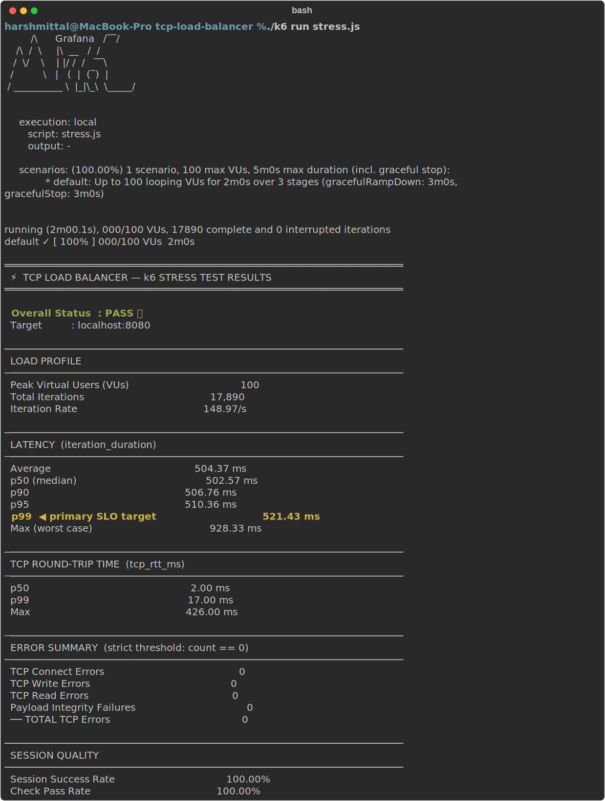

# TCP Load Balancer

A high-performance, Layer-4 (TCP) Load Balancer written entirely in Go with zero external dependencies.

This project was built to handle massive concurrent connection volumes efficiently. It routes raw TCP traffic using a **consistent hash ring** for deterministic session affinity, monitors backend health with **active probing**, and features **graceful shutdown** capabilities.



## Highlights

*   **Zero-Dependency Core:** Only relies on the Go standard library (`net`, `sync`, `io`, etc.).
*   **High Throughput:** Routinely tested to handle ~150 connections/second (18,000 continuous TCP handshakes in 2 mins) with a p99 latency overhead of just **17ms**.
*   **Consistent Hashing:** Uses FNV-1a hashing and 100 virtual nodes per backend to ensure uniform traffic distribution and session stickiness.
*   **Active Health Monitoring:** Automatically detects failing nodes and evicts them from the routing ring without dropping existing healthy sessions. Reintegrates them automatically when they recover.
*   **Memory Efficient:** Uses custom, pre-allocated 32KiB byte slices for bidirectional `io.CopyBuffer` tunnels to minimize garbage collection spikes.

## Architecture

For a deep dive into the system design, algorithmic choices, and the specific `sync.RWMutex` concurrency models used, please read the [System Design Document (DESIGN.md)](./DESIGN.md).

## Getting Started

You can run the entire cluster (1 Load Balancer + 3 TCP Echo Backends) locally using Docker Compose.

### Prerequisites
*   Docker & Docker Compose
*   Go 1.24+ (if running locally without Docker)
*   [k6](https://k6.io/) (if running the stress tests)

### Running the Cluster

1.  Start the proxy and the three backend servers:
    ```bash
    docker compose up --build
    ```

2.  Test the proxy by sending a raw TCP payload via `nc` (netcat):
    ```bash
    echo "Hello from client!" | nc localhost 8080
    ```
    *You should see the payload echoed back immediately from one of the healthy backend nodes.*

3.  View the real-time HTTP stats dashboard:
    Navigate to `http://localhost:9090` in your web browser.

## Load Testing

The system is rigorously load-tested using a custom `xk6-tcp` binary. The load test script (`stress.js`) simulates heavy traffic by continuously opening connections, transmitting data, verifying integrity, and gracefully closing.

To run the load test against your local instance:

1. Build the custom k6 binary with TCP support (requires Go):
    ```bash
    go install go.k6.io/xk6/cmd/xk6@latest
    xk6 build --with github.com/NAlexPear/xk6-tcp
    ```

2. Run the test:
    ```bash
    ./k6 run stress.js
    ```
